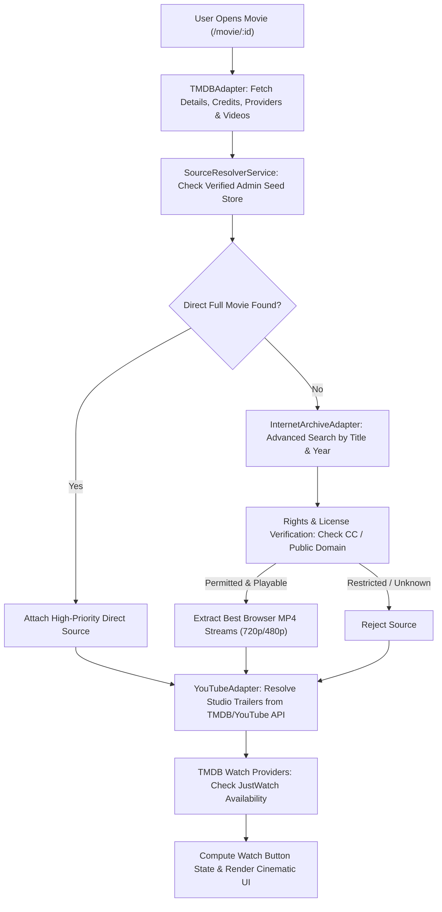

# 🎬 Movie Explorer — Legal Movie Discovery & Free Streaming Platform

A production-ready movie discovery, search, and legal free-streaming web application. Built with Angular 19, TypeScript, Tailwind CSS, Express, and multi-source API adapters with caching, rate limiting, and zero-piracy legal source resolution.

---

## 🌟 Key Features

- **Cinematic Dark Interface:** Designed for movie lovers with dynamic hero banners, responsive aspect-ratio cards, smooth horizontal carousels, and glassmorphism headers.
- **Strict Legal Free Streaming:** Direct playback for verified public domain cinema and open-access collections via the **Internet Archive**. No unauthorized streams, no scraping, no pirated content.
- **Smart Source Matching & Priority Resolution:**
  1. *Verified Legal Direct Streams* (Internet Archive — 720p / 480p MP4)
  2. *Verified Authorized Vimeo Playback* (when enabled)
  3. *Official YouTube Trailers & Teasers* (vetted official studio keys via YouTube API embed)
  4. *External Streaming Provider Options* (JustWatch data via TMDB)
  5. *Zero-Stream Fallback* ("No Free Stream Available" notice with where-to-watch and trailer options)
- **Professional Video Player (`/watch/:id`):**
  - Custom HTML5 player for direct MP4 streams with Play/Pause, Seek bar, Time formatting, Volume slider, Speed selection (0.5x to 2x), Picture-in-Picture, Fullscreen.
  - Official YouTube embed with secure `youtube-nocookie.com`.
  - In-player Source Selector with instant stream switching.
  - Auto-resume prompt ("Resume from 24:15?").
- **Real-Time Watch History (`/history`):**
  - "Continue Watching" row with visual progress bars.
  - "Recently Watched" list with timestamp and completed status.
  - Auto-saves playback position every 5 seconds.
- **Watchlist & Favorites (`/favorites`):**
  - Save/remove favorites with instant reactive state.
  - Direct quick-watch button from saved cards.
- **Global Search with Live Suggestions:**
  - Real-time debounced dropdown with poster, title, type (Movie, TV, Person), and rating.
  - Full search results page with category filters (`/search?q=...`).
- **Comprehensive Browsing Categories:**
  - `/latest` — Grid layout with filter drawer, sort options, and in-page search matching the reference website.
  - `/trending` — Trending today and this week.
  - `/popular` — Top popular titles.
  - `/top-rated` — Highest rated classics of all time.
  - `/now-playing` — Currently in theaters.
  - `/upcoming` — Anticipated releases.
  - `/free-movies` — Curated verified legal full movies.
  - `/genres/:genre` — Genre-specific explorer.
- **Admin Source Management (`/admin`):**
  - View resolved sources, toggle source approvals, and add manually verified legal sources with SSRF protection against private network hosts.
- **Full Attribution & Compliance:**
  - Official attribution for TMDB, JustWatch, Internet Archive, and YouTube.

---

## 🏗️ Architecture

```
Movie Explorer Fullstack Architecture
───────────────────────────────────────────────────────────────────────────
Browser (Angular 19 Standalone + Tailwind CSS)
   │
   │  Proxy /api calls (or served statically by Express in production)
   ▼
Backend Proxy Layer (Express + TypeScript + In-Memory TTL Cache)
   │
   ├─► TMDBAdapter (Primary metadata, cast, genres, discover, watch providers)
   ├─► InternetArchiveAdapter (Legal public domain cinema, MP4 extraction, rights check)
   ├─► YouTubeAdapter (Official trailers and legally embeddable video clips)
   ├─► VimeoAdapter (Authorized video streams when configured)
   ├─► SourceResolverService (Multi-source resolution, priority ranking, status flags)
   └─► AdminSourceStore (Curated seed database + manual verified legal sources)
```

### Source Resolution & Anti-Piracy Flow



---

## 🔒 Legal & Content Policy: Zero Piracy Guarantee

Movie Explorer is built strictly for lawful media consumption:
1. **No Scraping of Subscription Services:** The application does not scrape Netflix, Disney+, Amazon Prime, Hulu, or illegal streaming sites.
2. **No DRM Bypassing:** The platform never circumvents Widevine, FairPlay, or DRM-encrypted streams.
3. **Public Domain & Creative Commons Verification:** The `InternetArchiveAdapter` inspects every item's `licenseurl`, `rights`, and collection tags. It rejects items marked "All rights reserved", lending-library copies, or commercial releases.
4. **Official Embed Compliance:** All YouTube and Vimeo videos use the official embeddable iframe players without downloading or extracting raw stream keys.

---

## ⚙️ Environment Variables

Create a `.env` file in the project root based on `.env.example`:

```bash
# Server Port
PORT=3000

# Application Environment (development, production)
APP_ENV=development

# TMDB API (Metadata, search, genres, credits, watch providers)
# Obtain free key at: https://www.themoviedb.org/settings/api
TMDB_API_KEY=675b1517e0b53ddcbfb61232248e60cd
TMDB_ACCESS_TOKEN=

# YouTube Data API v3 (Optional trailer query enrichment)
# Obtain key at: https://console.cloud.google.com/
YOUTUBE_API_KEY=

# Vimeo API (Optional authorized video playback)
VIMEO_ACCESS_TOKEN=
ENABLE_VIMEO=false

# Feature Flags
ENABLE_INTERNET_ARCHIVE=true
ENABLE_YOUTUBE=true

# CORS
CORS_ORIGIN=*
```

---

## 🚀 Setup & Development

### Prerequisites
- **Node.js**: v18.0.0 or higher (v20+ recommended)
- **npm**: v9.0.0 or higher

### 1. Install Dependencies
```bash
npm install
```

### 2. Run Backend Tests
Run the unit and integration tests verifying title slugs, Internet Archive license filters, YouTube trailer matching, SSRF protection, and watch button logic:
```bash
npm run test:server
```

### 3. Start Development Servers
Run the Express backend API:
```bash
npm run server
```
In a second terminal, start the Angular development server:
```bash
npm start
```
The application will be running at `http://localhost:4200` with requests to `/api` automatically proxied to the Express backend at `http://localhost:3000`.

---

## 📦 Production Build & Deployment

### 1. Build the Frontend
```bash
npm run build
```
This generates the optimized production bundles in `dist/movie-search-app/browser`.

### 2. Start the Production Server
```bash
NODE_ENV=production npm run server
```
In production mode, the Express server serves both the REST API at `/api/*` and the static Angular frontend assets at `/`, supporting client-side HTML5 pushState routing for any URL (`/latest`, `/movie/:id`, `/watch/:id`, etc.).

---

## 📡 Backend API Endpoints

| Method | Endpoint | Description |
|---|---|---|
| `GET` | `/api/health` | Service health status and integration flags |
| `GET` | `/api/movies/latest` | Latest releases with filters (genre, year, rating, freeOnly) |
| `GET` | `/api/movies/trending` | Trending movies (`?timeWindow=day` or `week`) |
| `GET` | `/api/movies/popular` | Most popular movies |
| `GET` | `/api/movies/top-rated` | All-time highest rated movies |
| `GET` | `/api/movies/now-playing` | Movies currently in theaters |
| `GET` | `/api/movies/upcoming` | Upcoming movies |
| `GET` | `/api/movies/free-movies` | Curated verified legal full movies available for direct streaming |
| `GET` | `/api/movies/genres` | Available movie genre taxonomy |
| `GET` | `/api/movies/search?q=` | Global search across Movies, TV, and People |
| `GET` | `/api/movies/:id` | Full normalized movie details |
| `GET` | `/api/movies/:id/sources`| Resolved legal playback sources and watch action |
| `GET` | `/api/movies/:id/trailers`| Official trailers and clips |
| `GET` | `/api/movies/:id/providers`| JustWatch streaming providers (Stream, Rent, Buy) |
| `GET` | `/api/admin/sources` | List all verified legal sources |
| `POST`| `/api/admin/sources` | Add manually verified legal stream (with SSRF check) |
| `PATCH`| `/api/admin/sources/:id/approve` | Toggle source approval |
| `DELETE`| `/api/admin/sources/:id` | Delete source |

---

## ⚖️ Required Attributions

1. **TMDB:** This product uses the TMDB API but is not endorsed or certified by TMDB.
2. **JustWatch:** Streaming availability data is powered by JustWatch via the TMDB API.
3. **Internet Archive:** Free public domain and open-access media files are hosted and provided by Archive.org.
4. **YouTube:** Embedded trailer videos comply with YouTube API Terms of Service.
